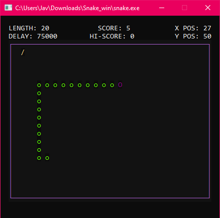

# Snake Game

A classic Snake game implemented in C++ using the ncurses library for terminal-based graphics.

## Controls:

- Use the arrow keys (Up, Down, Left, Right) to control the snake's direction.

